## Linux

什么时候使用linux操作系统？

答：作为网站的服务器系统使用

apache、php、mysql等服务软件需要安装在此系统里边。

该系统特点：稳定、免费、网络功能丰富、安全

网站服务器运行的操作系统就是linux

做一个虚拟的裸机电脑。使用软件制作逻辑电脑：vmware、virtualbox

## 攒一个虚拟裸机电脑

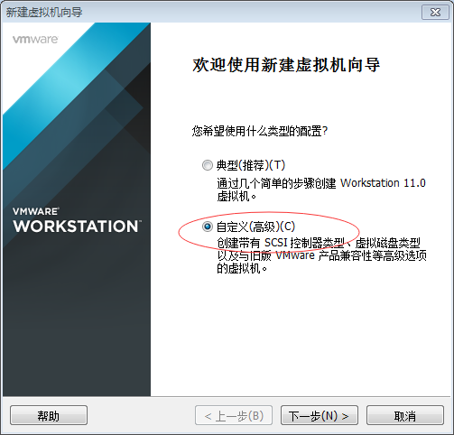

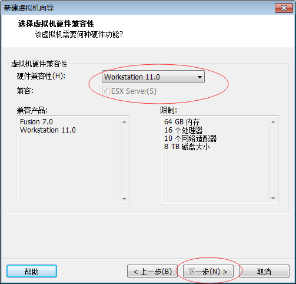

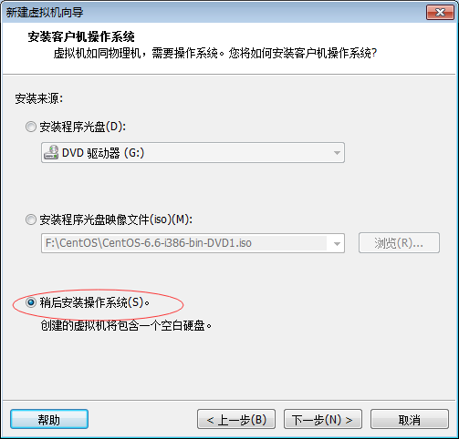

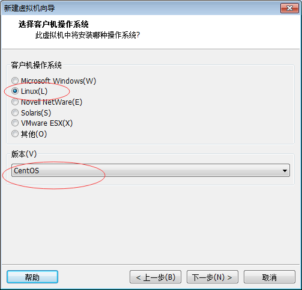

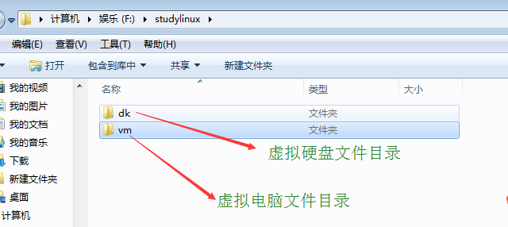

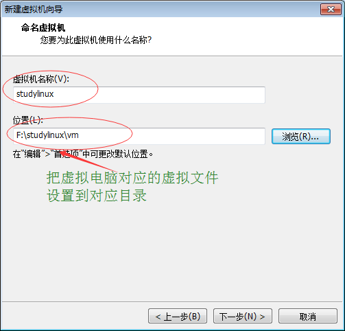

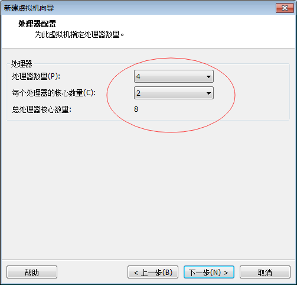

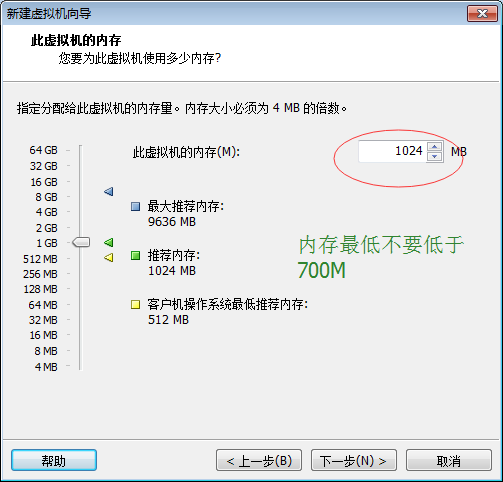

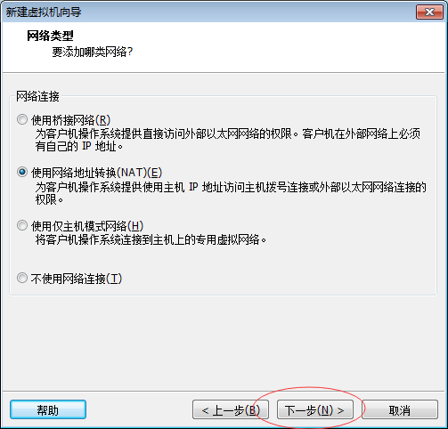

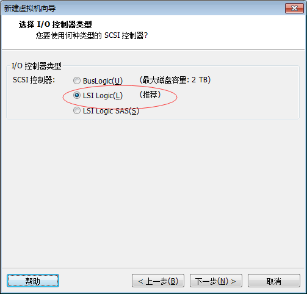

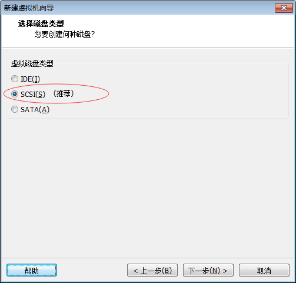

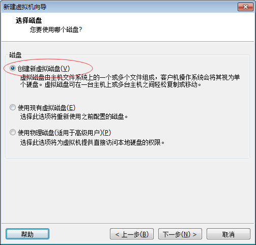

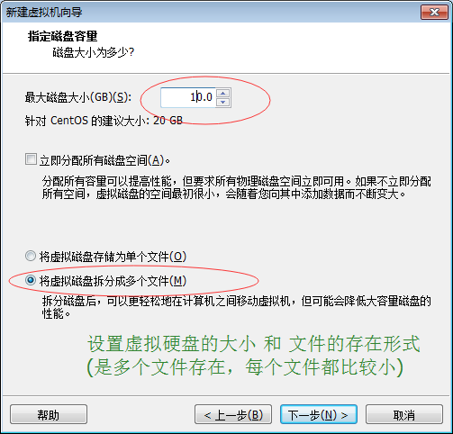

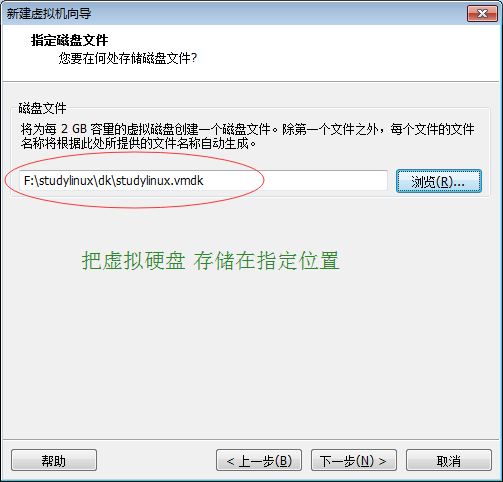

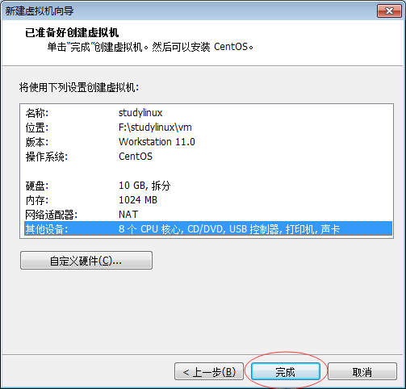

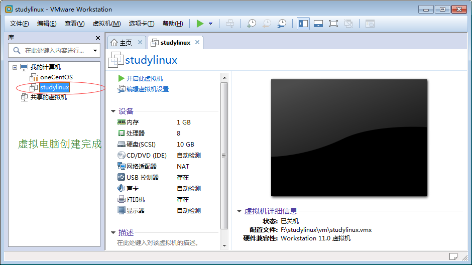

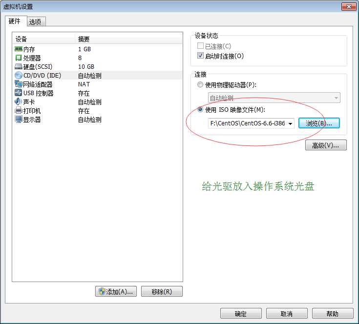