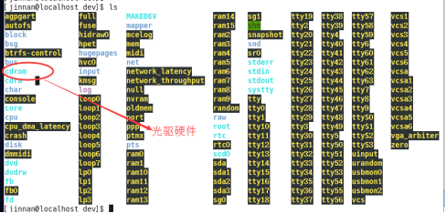
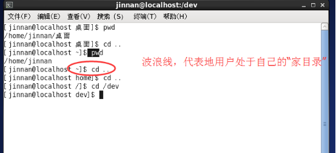
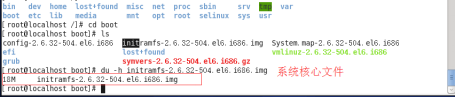

## 根目录文件介绍

## 内核文件与发行版

Linux操作系统是1991年芬兰 赫尔辛基大学一个大学生 林纳斯.脱瓦斯 发明的一个类Unix操作系统。林纳斯 开发的部分就是操作系统系统的“内核文件”。

发行版：指的是由软件发行公司，把一定的Linux内核版本、应用程序和相应的系统管理软件和安装程序，组装成一个发行套件。

发行版：内核版本文件 + 外围软件(图形化界面、安装程序、办公软件、记事本、编译器、解释器等等)
Redhat: 内核文件 + 外围软件
CentOS6.6:  redhat发行版 + 企业相关软件

发行版本号码，由发行商自己决定，一般与内核版本的数字不一样。

全世界的linux系统的种类有上百种，它们都是linux不同的发行版。
目前Linux中国的发行版本（Linux Distribution）主要有Red Hat（红帽子）, Slackware, Caldera, Debian, Red Flag（红旗）, Blue Point（蓝点）, Xteam Linux（冲浪）, Happy Linux（幸福Linux）, Xlinux、ubuntu等若干种，推荐同学们使用的发行版本是CentOS，其是对红帽封装的企业版。