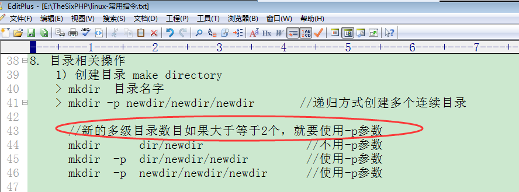

### 目录创建、移动、改名字、复制、删除




## 相对路径与绝对路径


目录1:/home/jinnan/tianjin/ningliao/dalian/jinzhou

目录2:/etc/sysconfig/network-script/

jinzhou---->network-scirpt:  cd  /etc/sysconfig/network-script  [绝对路径]推荐

```bash
# [相对路径]
cd  ../../../../../../etc/sysconfig/network-scirpt 
```

jinzhou---->dalian  ：  cd  ../  [相对路径]推荐

```bash
# [绝对路径]
cd  /home/jinnan/tianjin/ningliao/dalian  
```

在linux系统里边**到达一个地方**或**获得一个文件**，绝对路径和相对路径做选择性使用。