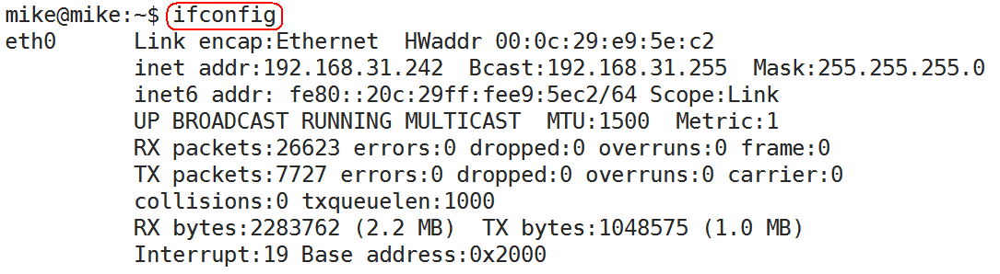
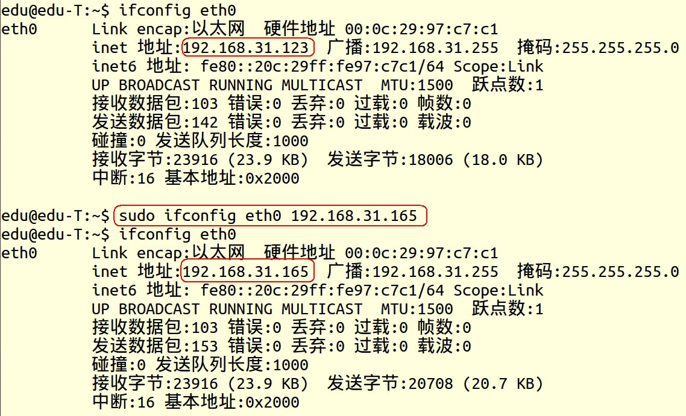
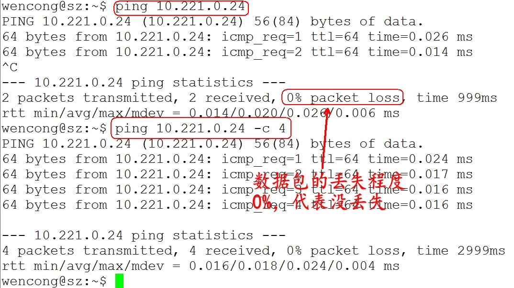

## 查看或配置网卡信息：ifconfige

如果，我们只是敲：ifconfig，它会显示所有网卡的信息：



| 显示字段    | 说明                                                         |
| ----------- | ------------------------------------------------------------ |
| eth0        | 网络接口名称                                                 |
| Link encap  | 链路封装协议                                                 |
| Hwaddr      | 网络接口的MAC地址                                            |
| Inet addr   | IP地址                                                       |
| Bcast       | 广播地址                                                     |
| Mask        | 子网掩码                                                     |
| UP          | 网络接口状态标识，UP已经启用，DOWN已经停用                   |
| BROADCAST   | 广播标识，标识网络接口是否支持广播                           |
| RUNNING     | 传输标识，标识网络接口是否已经开始传输分组数据               |
| MULTICAST   | 多播标识，标识网络接口是否支持多播                           |
| MTU，Metric | MTU:最大传输单位，单位：字节。Metric:度量值，用于RIP建立网络路由用 |
| RX bytes    | 接收数据字节统计                                             |
| TX bytes    | 发送数据字节统计                                             |

我们可以通过ifconfig配置网络参数：

- 只有root才能用ifconfig配置参数，其他用户只能查看网络配置
- ifconfig 网络接口名称 [地址协议类型][address] [参数]
- 地址协议类型如：inet(IPv4),inet6(IPv6)等
- 如:ifconfig eth0 inet 192.168.10.254 netmask 255.255.255.0 up

常用参数

| 参数               | 功能                 |
| ------------------ | -------------------- |
| -a                 | 显示所有网络接口状态 |
| inet  [IP地址]     | 设置IP地址           |
| netmask [子网掩码] | 设置子网掩码         |
| up                 | 启用网络接口         |
| down               | 关闭网络接口         |

ifconfig配置的网络参数在内存中，计算机重新启动之后就失效了，如果需要持久有效就需要修改网络接口的配置文件：

redhat修改/etc/sysconfig/network-scripts/ifcfg-eth0文件

```
IPADDR=IP地址
GATEWAY=默认网关
```

ubuntu修改/etc/NetworkManager/system-connections/Wired connection 1文件

```
[ipv4]
method=manual
addresses1=IP地址;24;默认网关;
```



## 测试远程主机连通性：ping

- ping通过ICMP协议向远程主机发送ECHO_REQUEST请求，期望主机回复ECHO_REPLY消息
- 通过ping命令可以检查是否与远程主机建立了TCP/IP连接

使用方法：ping [参数] 远程主机IP地址

| 参数 | 功能                                                     |
| ---- | -------------------------------------------------------- |
| -a   | 每次相应时都发出声音警示                                 |
| -A   | 表示以实际往返相应时间为间隔，连续发送消息               |
| -f   | 连续不断发送消息，不管是否收到相应                       |
| -n   | 只显示主机IP，不需要把IP解释成主机名                     |
| -c   | 发送指定次数数据报信息后停止，ping -c 5 192.168.10.254   |
| -i   | 每次发送消息时间间隔，默认一秒，ping -i 2 192.168.10.254 |
| -s   | 分组数据大小，默认56字节                                 |
| -w   | 以秒为单位的超时值，一旦超时，就立即停止                 |



## 网络路由设置：route

route可以增加，修改，显示路由信息，使用格式如下

```
route [-v] [-A family] add default [gw 默认网关地址] [[dev interface]]
```

| 参数 | 功能                               |
| ---- | ---------------------------------- |
| add  | 增加路由信息                       |
| del  | 删除路由信息                       |
| -v   | 显示路由信息                       |
| -A   | 指定网络协议inet(IPv4),inet6(IPv6) |
| gw   | 指定默认网关地址                   |
| dev  | 指定网络接口                       |

示例：`route add default gw 192.168.1.1 dev eth0`

## 监控网络状态：netstat

netstat命令监控网络状态，包括接口设置，IP路由，各种网络协议的统计，netstat输出信息说明如下：

| 字段            | 说明                                                 |
| --------------- | ---------------------------------------------------- |
| Proto           | 协议,如：tcp,udp                                     |
| Recv-Q          | 尚未读取的数据字节数                                 |
| Send-Q          | 尚未发送的数据字节数                                 |
| Local_address   | 本地主机地址与端口号                                 |
| Foreign_address | 远程主机与端口号                                     |
| State           | 网络连接状态                                         |
| RefCnt          | 引用计数，表示加接到相应套接字的进程数量             |
| Flags           | 标志字段                                             |
| Type            | 套接字类型,如：（SOCK_DGRAM, SOCK_STREAM，SOCK_RAW） |
| State           | 套接字状态                                           |
| Path            | 套接字路径名                                         |

netstat常用命令参数

| 参数 | 功能                                                       |
| ---- | ---------------------------------------------------------- |
| -a   | 列出所有端口                                               |
| -i   | 显示网络接口列表                                           |
| -at  | 所有tcp端口                                                |
| -au  | 所有udp端口                                                |
| -l   | 所有监听端口                                               |
| -lt  | tcp监听端口                                                |
| -lu  | 指定网络接口                                               |
| -s   | 显示所有协议统计信息                                       |
| -r   | 当前路由状态                                               |
| -p   | 输出中显示 PID 和进程名称，可以与其它开关一起使用，如：-pt |

## 局域网工作机制和网络地址配置

```bash
# 查看系统网卡信息
ifconfig
ifdown
ifup
# 查看无线连接情况
iwconfig
# 扫描无线网
iwlist 网卡名 scanning | grep ESSID
# 配置链接
iwpriv 网卡名 set key=value
# 连接网络
iwpriv 网卡名 set SSID=wifi-name  
iwconfig 网卡名 essid wifi-name  
# 重启网络服务
sudo service networking restart
# 重启网络配置
sudo /etc/init.d/networking restart
sudo service network-manager restart
# 查看网卡的硬件信息
lshw -class network
# 激活网卡
sudo ifconfig 网卡设备名 up
# 查看网卡设备信息
lspci | grep -i net
# 打开硬件开关
rfkill list all
# 查看网卡驱动是否加载
lsmod
# 加载网卡驱动
modprobe
# 开启网络管理器
service NetworkManager start
nslookup
# 查看dns
nslookup server
hostname
```

- 局域网络 (Local Area Network, LAN)
  - 以太网络Ethernet
  - MAC (Media Access Control)
- 广域网 (Wide Area Network, WAN)
  - ADSL 调制解调器
- OSI 七层协议 (Open System Interconnection)
- TCP/IP
- 路由

### IP地址

IP (InternetProtocol)

```bash
ifconfig
# 关闭网卡
ifconfig netname down
# 启动网卡
ifconfig netname up
ifdown netname
ifup netname
iwconfig
ping ip
ping -c次数 ip
```

### NETMASK

子网掩码：用来判断自己属于那个网段，255.255.255.0

网段的计算：IP地址的二进制 & 子网掩码的二进制 = 网段地址

192.168.33.2 & 255.255.255.0 = 192.168.33.0

### GATEWAY

网关，就是网络的总出口，也就是路由器的地址，路由器/交换机就是一个网关

```bash
route -n
# 配置网关
route add des gw ip
route add des gw ip dev 网卡名
# 删除网关
route del des gw ip
```

### DNS

域名解析服务器，就是解析域名成对应的ip地址
填网关地址即可

www.google.com 是主机名，google.com是域名

```bash
# nameserver 192.168.1.1
sudo gedit /etc/resolvconf/resolv.conf.d/base 
```

### hosts文件

配置域名ip映射，ip地址和对应的主机名

## 网络配置
网卡的配置文件/etc/network/interfaces
DNS配置文件/etc/resolvconf/resolv.conf.d/base
```
auto eth0
iface eth0 inet static
address 192.168.1.100
netmask 255.255.255.0
gateway 192.168.1.1
```
命令配置网络
```bash
# 修改网卡IP和子网掩码
sudo ifconfig eth0 192.168.1.1 netmask 255.255.255.0

# 查看网关
route -n
# 修改网关
sudo route add default gw 192.168.0.1

sudo stop network-manager
sudo start network-manager
```