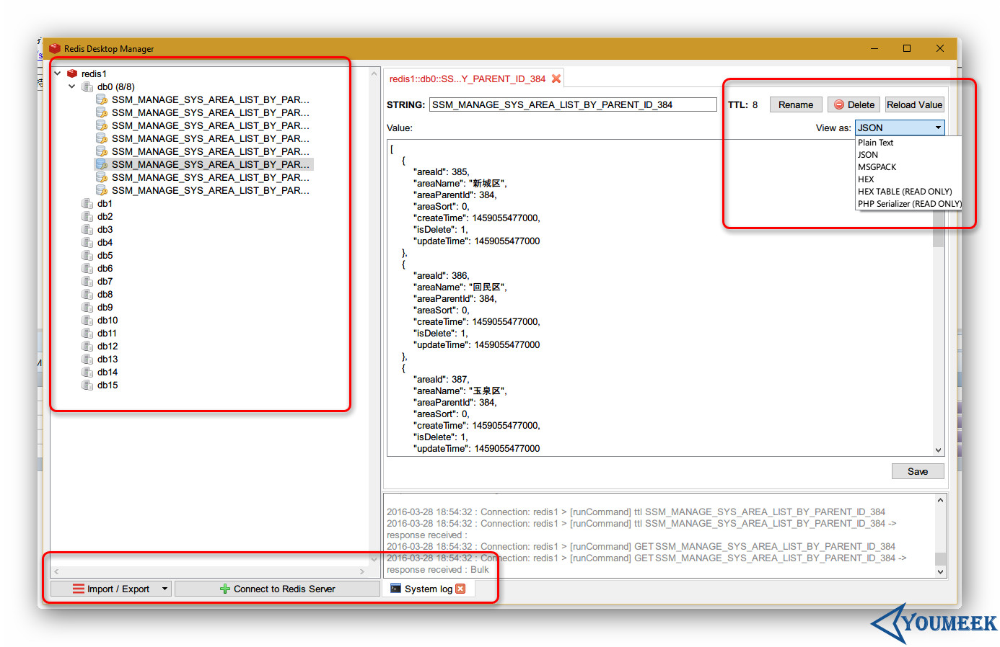

## Redis 安装和配置


## Redis 安装

- Redis 安装
    - 官网：<http://redis.io/>
    - 官网下载：<http://redis.io/download>
    - 官网 Github 地址：<https://github.com/redis>
    - 此时（20160212） Redis 最新稳定版本为：**3.0.7**
    - 官网帮助中心：<http://redis.io/documentation>
    - 我个人习惯 `/opt` 目录下创建一个目录 `setups` 用来存放各种软件安装包；在 `/usr` 目录下创建一个 `program` 用来存放各种解压后的软件包，下面的讲解也都是基于此习惯
    - 我个人已经使用了第三方源：`EPEL、RepoForge`，如果你出现 `yum install XXXXX` 安装不成功的话，很有可能就是你没有相关源，请查看我对源设置的文章
    - Redis 下载：`wget http://download.redis.io/releases/redis-3.0.7.tar.gz` （大小：1.4 M）
        - 安装依赖包：`yum install -y gcc-c++ tcl`
        - 解压：`tar zxvf redis-3.0.7.tar.gz`
        - 移动到我个人安装目录：`mv redis-3.0.7/ /usr/program/`
        - 进入解压后目录：`cd /usr/program/redis-3.0.7/`
        - 编译：`make`
        - 编译安装：`make install`
            - 安装完之后会在：`/usr/local/bin` 目录下生成好几个 redis 相关的文件
        - 复制配置文件：`cp /usr/program/redis-3.0.7/redis.conf /etc/`
        - 修改配置：`vim /etc/redis.conf`
            - 把旧值：`daemonize no` 
            - 改为新值：`daemonize yes` 
        - 启动：`/usr/local/bin/redis-server /etc/redis.conf`
        - 关闭：`redis-cli -h 127.0.0.1 -p 6379 shutdown`
        - 查看是否启动：`ps -ef | grep redis`
        - 进入客户端：`redis-cli`
        - 关闭客户端：`redis-cli shutdown`
        - 开机启动配置：`echo "/usr/local/bin/redis-server /etc/redis.conf" >> /etc/rc.local`
        - 开放防火墙端口：
            - 添加规则：`iptables -I INPUT -p tcp -m tcp --dport 6379 -j ACCEPT`
            - 保存规则：`service iptables save`
            - 重启 iptables：`service iptables restart`


## Redis-3.0.7 配置

- 编辑配置文件：`vim /etc/redis.conf`
- Redis 默认的配置文件内容：

``` ini
# 是否以后台daemon方式运行，默认是 no，一般我们会改为 yes
daemonize no
pidfile /var/run/redis.pid
port 6379
tcp-backlog 511
timeout 0
tcp-keepalive 0
loglevel notice
logfile ""
# 开启数据库的数量，Redis 是有数据库概念的，默认是 16 个，数字从 0 ~ 15
databases 16
save 900 1
save 300 10
save 60 10000
stop-writes-on-bgsave-error yes
rdbcompression yes
rdbchecksum yes
dbfilename dump.rdb
dir ./
slave-serve-stale-data yes
slave-read-only yes
repl-diskless-sync no
repl-diskless-sync-delay 5
repl-disable-tcp-nodelay no
slave-priority 100
appendonly no
appendfilename "appendonly.aof"
appendfsync everysec
no-appendfsync-on-rewrite no
auto-aof-rewrite-percentage 100
auto-aof-rewrite-min-size 64mb
aof-load-truncated yes
lua-time-limit 5000
slowlog-log-slower-than 10000
slowlog-max-len 128
latency-monitor-threshold 0
notify-keyspace-events ""
hash-max-ziplist-entries 512
hash-max-ziplist-value 64
list-max-ziplist-entries 512
list-max-ziplist-value 64
set-max-intset-entries 512
zset-max-ziplist-entries 128
zset-max-ziplist-value 64
hll-sparse-max-bytes 3000
activerehashing yes
client-output-buffer-limit normal 0 0 0
client-output-buffer-limit slave 256mb 64mb 60
client-output-buffer-limit pubsub 32mb 8mb 60
hz 10
aof-rewrite-incremental-fsync yes
```


## Redis-3.2.8 配置

- 编辑配置文件：`vim /etc/redis.conf`
- Redis 默认的配置文件内容：

``` ini
# 默认绑定是：127.0.0.1，这样就只能本机才能连上，为了让所有机子连上，这里需要改为：0.0.0.0
bind 0.0.0.0
protected-mode yes
port 6379
tcp-backlog 511
timeout 0
tcp-keepalive 300
daemonize yes
supervised no
pidfile /var/run/redis_6379.pid
loglevel notice
logfile ""
databases 16
save 900 1
save 300 10
save 60 10000
stop-writes-on-bgsave-error yes
rdbcompression yes
rdbchecksum yes
dbfilename dump.rdb
dir ./
slave-serve-stale-data yes
slave-read-only yes
repl-diskless-sync no
repl-diskless-sync-delay 5
repl-disable-tcp-nodelay no
slave-priority 100
appendonly no
appendfilename "appendonly.aof"
appendfsync everysec
no-appendfsync-on-rewrite no
auto-aof-rewrite-percentage 100
auto-aof-rewrite-min-size 64mb
aof-load-truncated yes
lua-time-limit 5000
slowlog-log-slower-than 10000
slowlog-max-len 128
latency-monitor-threshold 0
notify-keyspace-events ""
hash-max-ziplist-entries 512
hash-max-ziplist-value 64
list-max-ziplist-size -2
list-compress-depth 0
set-max-intset-entries 512
zset-max-ziplist-entries 128
zset-max-ziplist-value 64
hll-sparse-max-bytes 3000
activerehashing yes
client-output-buffer-limit normal 0 0 0
client-output-buffer-limit slave 256mb 64mb 60
client-output-buffer-limit pubsub 32mb 8mb 60
hz 10
aof-rewrite-incremental-fsync yes
```

## 设置 Redis 请求密码

- 打开 `vim /etc/redis.conf` 配置文件，找到默认是被注释的这一行：`# requirepass foobared`
- 去掉注释，把 `foobared` 改为你想要设置的密码，比如我打算设置为：123456，所以我改为：`requirepass 123456`
- 修改之后重启下服务
- 有了密码之后，进入客户端，就得这样访问：`redis-cli -h 127.0.0.1 -p 6379 -a 123456 `
- 如果用 IP 进入客户端，但是报：`Could not connect to Redis at 192.168.1.121:6379: Connection refused`
	- 原因：Redis 默认只允许本机访问，可是有时候我们也需要 Redis 被远程访问。         
	- 解决办法：
        - 修改 Redis 配置文件：`vim /etc/redis.conf`
        - 找到 bind 那行配置，默认是：`# bind 127.0.0.1`
        - 去掉 # 注释并改为：`bind 0.0.0.0`

## Redis 常用命令

- 命令是不区分大小写的，但是这里为了方便和后面的 key value 进行区分所以我全部写大写，你也可以用小写。
    - 但是需要注意的是：key 是完全区分大小写的，比如 key=codeBlog 和 key=codeblog 是两个键值
- 官网命令列表：<http://redis.io/commands>
- `SET key value`，设值。eg：`SET myblog www.youmeek.com`
- `GET key`，取值
- `INCR key`，递增数字
- `DECR key`，递减数字
- `KEYS *`，查看当前数据库下所有的 key
- `APPEND key value`，给尾部追加内容，如果要追加的 key 不存在，则相当于 SET key value
- `STRLEN key`，返回键值的长度，如果键不存在则返回 0
- `MSET key1 value1 key2 value2`，同时设置多值
- `MGET key1 value1 key2 value2`，同时取多值
- `EXPIRE key 27`，设置指定键的生存时间，27 的单位是秒
- `TTL key`，查看键的剩余生存时间
    - 返回 -2，表示不存在，过了生存时间后被删除
    - 返回 -1，表示没有生存时间，永久存储
    - 返回正整数，表示还剩下对应的生存时间
- `PERSIST key`，清除生成时间，重新变成永久存储（重新设置 key 的值也可以起到清除生存时间的效果）
- `FLUSHDB`，清空当前数据库所有键值
- `FLUSHALL`，清空所有数据库的所有键值


## 把 redis 添加到系统服务中

- 新建文件：`vim /etc/init.d/redis`
- 添加如下内容：

``` nginx
#!/bin/sh  
#  
# redis - this script starts and stops the redis-server daemon  
#  
# chkconfig:   - 85 15  
# description:  Redis is a persistent key-value database  
# processname: redis-server  
# config:      /usr/local/redis-2.4.X/bin/redis-server  
# config:      /usr/local/ /redis-2.4.X/etc/redis.conf  
# Source function library.  
. /etc/rc.d/init.d/functions  
# Source networking configuration.  
. /etc/sysconfig/network  
# Check that networking is up.  
[ "$NETWORKING" = "no" ] && exit 0  
redis="/usr/local/bin/redis-server" 
prog=$(basename $redis)  
REDIS_CONF_FILE="/etc/redis.conf" 
[ -f /etc/sysconfig/redis ] && . /etc/sysconfig/redis  
lockfile=/var/lock/subsys/redis  
start() {  
    [ -x $redis ] || exit 5  
    [ -f $REDIS_CONF_FILE ] || exit 6  
    echo -n $"Starting $prog: "  
    daemon $redis $REDIS_CONF_FILE  
    retval=$?  
    echo  
    [ $retval -eq 0 ] && touch $lockfile  
    return $retval  
}  
stop() {  
    echo -n $"Stopping $prog: "  
    killproc $prog -QUIT  
    retval=$?  
    echo  
    [ $retval -eq 0 ] && rm -f $lockfile  
    return $retval  
}  
restart() {  
    stop  
    start  
}  
reload() {  
    echo -n $"Reloading $prog: "  
    killproc $redis -HUP  
    RETVAL=$?  
    echo  
}  
force_reload() {  
    restart  
}  
rh_status() {  
    status $prog  
}  
rh_status_q() {  
    rh_status >/dev/null 2>&1  
}  
case "$1" in  
    start)  
        rh_status_q && exit 0  
        $1  
        ;;  
    stop)  
        rh_status_q || exit 0  
        $1  
        ;;  
    restart|configtest)  
        $1  
        ;;  
    reload)  
        rh_status_q || exit 7  
        $1  
        ;;  
    force-reload)  
        force_reload  
        ;;  
    status)  
        rh_status  
        ;;  
    condrestart|try-restart)  
        rh_status_q || exit 0  
    ;;  
    *)  
        echo $"Usage: $0 {start|stop|status|restart|condrestart|try-restart| reload|orce-reload}"  
        exit 2  
esac
```

- 修改权限：`chmod 755 /etc/init.d/redis`
- 启动服务：`service redis start`
- 停止服务：`service redis stop`
- 重启服务：`service ngredisnx restart`


## Redis 客户端

- Java：<http://redis.io/clients#java>
    - Jedis 官网：<https://github.com/xetorthio/jedis>


## Redis GUI 管理工具

- Redis Desktop Manager
    - 官网：<http://redisdesktop.com/>
    - 官网下载：<http://redisdesktop.com/download>
    - 效果如下图：
    - 


## Redis 主从（主从从）配置

### Redis 主从架构

- 假设有两台服务器，一台做主，一台做从
    - Redis 主信息：
        - IP：**12.168.1.114**=
        - 端口：**6379**
    - Redis 从信息：
        - IP：**12.168.1.115**
        - 端口：**6379**
- 编辑从机的 Redis 配置文件，找到 210 行（大概），默认这一行应该是注释的：`# slaveof <masterip> <masterport>`
- 我们需要去掉该注释，并且填写我们自己的主机的 IP 和 端口，比如：`slaveof 192.168.1.114 6379`
- 配置完成后重启从机 Redis 服务
- 重启完之后，进入主机的 redis-cli 状态下，输入：`INFO replication`
    - 可以查询到当前主机的 redis 处于什么角色，有哪些从机已经连上主机。
- 此时已经完成了主从配置，我们可以测试下：
    - 我们进入主机的 redis-cli 状态，然后 set 某个值，比如：`set myblog YouMeek.com`
- 我们切换进入从机的 redis-cli 的状态下，获取刚刚设置的值看是否存在：`get myblog`，此时，我们可以发现是可以获取到值的。
- 但是有一个需要注意的：从库不具备写入数据能力，不然会报错。 从库只有只读能力。


### Redis主从从架构

- Redis 主从从的意思：看桌面上的截图。
- 优点，除了减少主库连接的压力，还有可以关掉主库的持久化功能，把持久化的功能交给从库进行处理。
- 第一个从库配置的信息是连上主库，后面的第二个从库配置的连接信息是连上第一个从库， 假如还有第三个从库的话，我们可以把第三个从库的配置信息连上第二个从库上，以此类推。


## Windows 版本的 Redis

- Windows 是别人改造的版本，需要到这里下载：<https://github.com/MSOpenTech/redis/releases>
- 使用 `.msi` 后缀的文件进行安装，此安装包自带安装 Windows 服务
- 配置文件也跟原版本不一样，叫做：`redis.windows.conf`


## 资料

- <http://yanshisan.blog.51cto.com/7879234/1377992>
- <https://segmentfault.com/a/1190000002685224>
- <http://itbilu.com/linux/management/4kB2ninp.html>
- <http://keenwon.com/1335.html>
