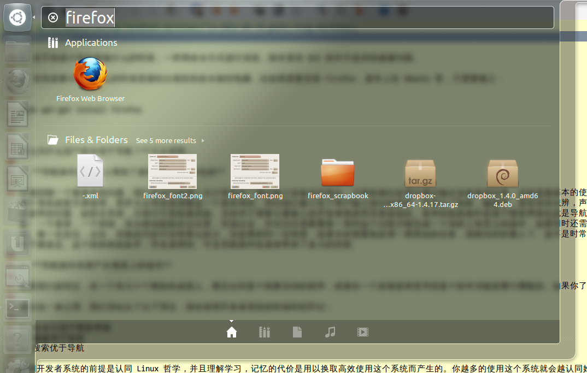

## 缘起

我大概是从2010年4月份开始把自己的桌面开发环境从 Windows XP 迁移到 Ubuntu 10.04 的，说起来也已经有两年半的 Ubuntu 使用经验。那次迁移的原因大致是因为某个阶段特别迷恋如何高效的操作电脑，当时把 Windows 整的很伏贴，但是说到高效的使用电脑，不可能对 Linux 系统视而不见。其次就是瞥到一个同事在捣鼓 Ubuntu， 加上毕竟 Windows 环境生存了十几年时间，再多的新鲜感也用尽了，当时很想试试在 Linux 下是不是可以完成在 Windows 下等价的工作。当然，两年半以后，很多结论都是不言自明的。所以《Ubuntu桌面生存指南》是我在两年半时间里，对 Ubuntu 这个发行版的使用心得，我会涉及必要的基础知识，帮助诸位理解，但是不会做到教科书式的面面俱到，或者涉猎太过艰深又不实用的技巧，行文的唯一目的正如题目所示，是尽可能帮助那些对 Ubuntu/Linux 感兴趣的人首先生存在这个平台，不至于因为这样那样的不方便错过或者误解一个优秀的发行版。

## 生存渐进史

Windows -> VirtualBox -> Wubi -> Dedicated Partition

想学习一个操作系统最好的手段就是把自己所有的日常工作都切换到那个操作系统里去，这种沉浸式的学习方法在很多领域都适用，比如学习一门外语，学习一种编程语言，不断的碰壁和寻找解决方案在最初可能花费大量的时间，但是，不断的记录问题，写下答案，反复的遇到相同的问题，参考答案，再次实践当初的答案或者找到更优的答案，如此循序渐进以后，如果你看到一个高手可以在你束手无策的时候敲下长长的一串莫名其妙的命令，然后扬长而去，千万别惊奇，这里面没有智力的成分，也没有记忆力好坏的区别——无奇，唯手熟尔。因此最初我是在公司的 Windows 下安装虚拟机，当我发觉这种剪不断理还乱的方式，让我仍旧依赖 Windows 的时候，促使我很快就转换到 Wubi 的安装方式，再接着稳定使用了一年半以后就正式把 Wubi 移植到独立分区，从物理分区的角度告别了使用将近十几年的 Windows 平台，转而，在 Ubuntu 的 host 里虚拟了 Windows 的 guest。至此，总共是两年半。完成了从 Windows Host with Ubuntu Guest 到 Ubuntu Host with Windows Guest 的转换。套用美国佬的世界观，我们终于可以从一个不自由的世界走向一个自由世界了。

## 三个虚拟世界：Linux， Mac， Windows

- Linux -> 开发人员，科学家，工程师的**开发者系统**
- Windows -> 老百姓的**普罗大众系统**
- Mac -> 上述两者之间，部分不明真相的群众，以及**高端装系统**

每个操作系统都有自己的用户，促成他们选择使用某一个系统的因素有很多，最大的原因是拒绝改变，这也成就了 Windows 平台的繁荣，但是这里不含贬义，拒绝改变的背后是因为普罗大众的生活重心并不全是计算机，他们更愿意把时间花在自己关心的领域，计算机只要够用，适用就可以接受。这一条不仅在非 IT 领域成立，即便在 IT 领域，如果你不是一线的开发人员，同样成立。撇开拒绝改变以外，每个能够存活到今天的系统本身都已经没有优劣的区分，剩下的就是理念，哲学，用途的区别，Windows， Mac， Linux 都有各自旗帜鲜明的个性，在那些不同的旗帜背后，都有坚定的拥护者，他们在自己的立场都做出了正确的选择。因此，不同阵营的旗手互相之间做无谓的争论幷无太多意义。但是如果你是一个暂时还没有使用 Ubuntu/Linux 的开发者，程序员，希望这个系列文章可以改变你的看法。

## 开发者的操作系统

Linux 是从极客的学生宿舍里走出来的操作系统，更是通过互联网完成协同开发的典范，汇集了全球极客的智慧。因此它也是一个开发者相当友好的操作系统，它的所有设计理念和哲学都是假定开发者作为最终用户的。从其它操作系统迁徙到 Linux 的时候一定要牢记这点，否则就无法理解很多事情。从这个角度说，很多争执哪个操作系统更优秀的前提就已经错了，比尔盖茨在1983年就告诉所有人他的梦想是人人有电脑可用。所以 Windows 注定是一个普罗大众为最终用户的系统，两个系统有各自的目标用户，那还吵什么呢？许多耸人听闻的报刊，杂志，博文时不时的就列出一些统计数据，然后吼一嗓子：“Linux 桌面已死！”，真心混淆视听。不过在一个商业化气氛浓厚的社会，即便是开发人员，我们也已经太长时间被 Windows 这样假定普罗大众为最终用户的系统惯坏了。我们习惯下载安装二进制文件而不是从源码开始编译，我们习惯使用鼠标而不是键盘操作电脑，我们认为没有图形界面不可想象，我们面对终端束手无策，并且经常分不清出方便和高效之间的差别。所以如果你从来没有认真使用过 Linux 千万别先忙着下结论，否则未免会有失偏颇。安装这个系统，使用这个系统，解决你的问题，然后再看是不是对你的胃口。理论上说，使用一个为开发者准备的操作系统不会有太多的为难，如果你感觉困难，只有两个原因，你拒绝改变或者你真心对开发这个事情没有兴趣，反之，适应了这个环境以后会感觉舒适，安逸。

为了让你或者他们自己更好的使用 Linux ，我们的前人做了很多事情。

1. **他们首先开源了代码**

   这是一个吓坏了封闭和专利系统制作者的决定。因为那些闭源厂商依靠贩卖专利和二进制文件获利，公布自己的代码，并且连带修改和发行权利也一并不要了，这在闭源厂商是不能想象的。相反在开源系统中，开发者求知的愿望被充分尊重了，他们可以任意阅读自己感兴趣的代码，获取知识，修补臭虫，甚至参与开源项目，结识更多其它有求知欲的极客，从而提高自己的开发水平。在闭源系统中，开发者只能依赖厂商提供的 API，文档以及定期的补丁包--这些同样是普罗大众不那么关心但是开发者所不能接受的。因此使用开源系统无疑可以增强自己的技能水准，并且在使用系统的同时有机会改进和修补自己的系统。

2. **他们更懂开发者**

   从诞生之初起，这就是一个极客玩出来的操作系统。与其说他们是在开发操作系统不如说他们是在满足开发者自己的需求，这就是著名的“吃狗食“理论，需要一个开发者系统：1. 动手做一个 -> 2. 生存在其中 -> 3. 体会优劣 -> 4. 修补不足，增进优势使它更适合开发 -> 循环至 1. 生存在其中。所以这个系统会越来越朝着它的方向发展，那就取悦开发者自己。经过大约二十多年的发展，今天的开发者系统已经积累了无数提升开发生产力的哲学，理念和工具软件。几乎你能想到的和未能想到的一切和开发相关的需求都已经在开发者系统上被满足了，你需要做的就是学习，练习和使用。即便这仍然不能满足你，开发者系统上很容易对已有的存在做一个分支然后进行自我满足的工作。某些时候没人比你自己更懂自己，更多的时候他们比你更懂你自己，使用开发者系统的开发者时常就会想到要是有这么一个功能就好了，然后 Google 一下相关资料，接着自言自语 “哦。。。果然已经有了”。物以类聚，人以群分，如果我们的行为方式和思维模式相近，那么先前的开发者早就遇到过相同的困扰并且动手解决了问题。你仍然只需要学习，练习和使用，仅此而已。他们懂得键盘比起鼠标在大多数开发场合更高效，他们懂得软件界面首先需要的是命令行，其次才是图形化界面，他们懂得命令优于导航的哲学，你需要编辑器/编译器，他们提供了伟大的 Vim，Emacs/gcc, g++，你需要好用的脚本语言，他们内置了Bash Shell/Python，你需要更高效的操作电脑，他们提供了无数的实用命令行程序，幷为几乎每一个程序配置了无数参数来满足你的需要，一旦我们理解他们这么做的初衷，剩下的还是学习，练习和使用。

3. **我们更懂自己吗？**

   不幸的是很多人接受了馈赠却开始抱怨：“这么多命令，参数怎么记得住？为什么没有像样的 GUI 版本，为什么没有像 VB 那样可拖拉的 IDE？ 我需要一个开箱即用的系统，不折腾!”。实际上我们幷没有开发这些程序，其实我们没有资格抱怨什么，如果我们需要的幷不存在于开发者系统，那么停止抱怨，仔细思考，更大的可能是：不存在意味着不需要，意味着存在会拖累生产力，违背开发者系统的哲学。很多的误解来自长期使用普罗大众系统，我们是被惯坏的一代，普罗大众系统假定用户依靠鼠标和直觉去操作系统，他们依靠尽量压缩用户的学习成本去博得方便使用的好名声，很多系统在这方面确实做得很好，很多人不需要阅读使用手册就可以使用软件和操作系统。这同样也是普罗大众系统经过几十年“吃狗食”得到的回报。但是仔细想想这是开发者需要的系统吗？普罗大众和开发者站在两个各自的立场，有各自的需求。如果开发者觉得普罗大众系统很好用，这现象本身就很值得探讨，肯定有地方出错了不是吗？ 何况这是一个开发者友好的系统，那么为什么还是有许多开发者并不适应？其实我们忘记了一个最简单的道理，技能是需要习得的。开发者不能按普罗大众的要求来要求自己，方便和高效其实并不是等价的，普罗大众系统的方便是依靠牺牲效率和可定制性来达成的，例如鼠标点击运行程序看起来比输入命令启动程序方便很多，但是如果你需要从上百个图标里寻找那个程序会怎么样？你又能不能启动程序的时候要求启动后最大化窗口？所以开发者系统开始不断增加命令，配置，选项和各类约定来追求效率和可定制性。而一旦我们认为效率和可定制性更重要的时候，记忆的负担，学习的成本就出现了，我们需要去学习记忆，熟练运用那些命令配置，了解约定，遵守约定。开发者需要不断的学习技能以追求更高效的使用开发者系统，这才是开发者和普罗大众的本质区别，这个世界上幷没有那么多好处全你占的事情，提升效率的前提便是增加学习成本，容忍一定程度的不那么方便。不想折腾又想高效的使用开发者系统就和没好好学过外语又想有流利的口语一样荒诞，我们所有的技能，除了本能以外，譬如：心算，语言，记忆力，专业技能都需要反复折腾才能获得，使用开发者系统同样如此。说不折腾的人，要么是普罗大众，要么被普罗大众系统搞傻了，要么就是身心老了，折腾不动了。了解这个事实以后，读者自行权衡，然后我们才能说接下来的事情。

## Linux 哲学

为了高效的使用开发者系统，Linux 哲学中最重要的一点就是**命令优于导航**。

导航操作是指人类通过视觉定位，进而层层递进的操作方式，通常由鼠标完成。例如浏览网页，点击链接进而继续浏览点击。对于普罗大众有以下几个情形，我们会使用导航方式：

1. 不知道自己想让计算机做什么或者计算机可以告诉我们什么，通过随意浏览方式挖掘我们可能可以让计算机做什么或者告诉我什么。最常见的案例就是在没有使用手册的情况下，所以点击菜单，看看某个软件都有哪些功能，或者是去门户网站，微博上刷刷有什么自己感兴趣的内容。
2. 我知道要计算机做什么，但是我需要先在一堆菜单，图标里找到我需要的按钮，在告诉计算机去做之前必须例行的完成数次导航操作，例如我想卸载某个游戏，就需要从点击菜单栏开始寻找到这个游戏的程序组，点击卸载图标。又例如我需要安装 Firefox，那我得先设法找到 Firefox 的官网，从其中找到下载链接，选择相适应的匹配版本，然后点击下载，等待完成后，去安装文件所在的文件夹，双击安装，期间还需要确认无数条款，选择安装目录，删减可选插件，最后确认安装。

命令操作则无需付出视觉定位的成本，如果你会盲打，基本上你可以直接使用快捷键或者敲击命令行对计算机进行操作，这些操作通常只依赖于键盘。由于标准键盘上有至少100个以上的按键，可以组合出无数的操作手法以应对各种复杂的情况，所以基本上键盘是最重要和最强大的计算机输入设备。很可惜普罗大众很多时候没有意识到这一点，只是在码字的时候才敲击键盘，却不善于真正使用键盘操控计算机的其它功能。我们会使用命令方式:

1. 在不知道计算机能做什么的时候，一样用命令方式进行浏览，除非某些 GUI 软件不提供快捷键功能。
2. 在知道要计算做什么的时候直接给出相应的命令操控电脑，比如我需要安装 Firefox，基本上在 Ubuntu 里，只需要键入：

```bash
sudo apt-get install firefox
```

那么为什么说**命令优于导航？**几点原因：

- **导航操作从生理上增加了使用电脑的额外负担**

仔细回顾一个最基本的问题：我们是如何使用一台计算机的？通过输入设备传达指令，计算机做出处理幷通过输出设备返回结果，这就是最基本的使用流程。无论是个人电脑，智能手机，平板都是这个流程。哪个系统更方便输入，哪个系统就更方便使用，普罗大众系统很清楚这一个基本准则，所以他们最小化了用户输入指令的成本，开发出了鼠标，触摸屏，甚至语音识辨，声控系统，光感系统。在公众视野制造了一波又一波的流行热。但是追求潮流并不解决效率的问题，如前文所述，方便幷不意味着高效。尤其对于需要大量输入的开发者系统而言更是如此。基本的鼠标操作是基于图形界面也就是导航的，我们通过鼠标传达指令，首先需要通过眼睛定位图形界面上操作对象的位置例如：一个菜单，一个按钮，其次移动鼠标定位位置，完成点击，并且往往需要重复一系列这个过程才能完成一个实际上有意义的操作，如果同时还需要大量的文本处理，那么双手还需要在鼠标和键盘之间做大量费时的切换工作。的确，每一次定位，点击，切换的代价幷没有那么的大，但是累积到一定程度，或者当你需要批处理一堆类似的任务，就相当的折磨人了。是不是时常感觉到右手肩关节有酸疼感？直接病因就是长期依赖右手握持鼠标，右肩无法呈自然下垂姿态。这个病俗称鼠标手，学名肩周琰。可见导航操作给身体带来了多大的伤害。命令操作的输入代价会大一些，但是让双手全程固定在了键盘上，对于文字输入者避免了切换鼠标的时间损耗，和注意力的被迫转移。命令本身，通过组合，也是对计算机系统最直接的指令下达，很多时候反而可以避免大量的导航工作。如前所述的 Firefox 安装。

- **导航操作容易产生视觉上的迷失**

前面我们提到过，在一个有几十个图标的桌面上，要定位到某个想要启动的程序，或者在一个多级菜单里寻找某个软件功能是费力费眼的。如果你了解等价的命令，直接键入程序名然后启动应用程序会快上很多倍。也就是说如果你知道你想干什么，使用键盘键入命令或者执行搜索，效果会比肉眼巡视来得高效很多。搜索这个概念在开发者系统的很多地方都贯穿得相当彻底，find/which/whereis/grep/vim/vimperator 很多命令都是基于搜索优于导航这一理念的。时刻养成搜索的习惯能帮助我们更高效的使用开发者系统。



- **命令操作更容易被开发，组合使用，以及更容易地进行参数调整，脚本化批量处理**

开发基于导航的 GUI 成本巨大而且容易出错，命令行则相反。这就让开发者在最初可以只集中精力处理命令本身需要完成的核心功能，而不是花费大量的时间在 GUI 的外壳上。通过几个小程序组合出更强悍的功能，通过调整不同的参数或者使用文本配置文件的方式进行随意的软件定制，甚至批处理一堆需要重复运行的计算机操作，这在命令行都是很自然的事情，GUI 想达成同样的目标就相当费力了。

- **便于远程管理计算机**

在桌面上强调使用命令，使得我们顺便捡到了一份红利，因为我们惯用命令，可以摆脱 GUI 的依赖，我们就能更好的登录到远程的机器上进行各种操作，因为使用命令的传输代价远远小于图形界面的远程传输，时至今日，ssh 远程登入仍然是 Linux 系统管理员远程管理电脑的标准方式。所有你在本地桌面上操练掌握的命令，都可以在远程服务器上别无二致的使用，不至于在只配备终端没有GUI的服务器上会感觉手足无措。

通过**命令优于导航**这一条公理，我们演化出了以下理念，请在使用开发者系统的时候时刻牢记：

1. 命令行优于图形界面
2. 键盘优于鼠标
3. 搜索优于导航

最后，使用开发者系统的前提是认同 Linux 哲学，理解学习，记忆的代价是用来换取高效使用开发者系统而产生的。你越多的付出脑力成本使用这个系统，就会越高效安逸的生存在这个系统中，也就越认同她的哲学，使得你付出更多的脑力成本，继而进入同时锻炼脑力和提高生产力的良性循环中。这种变化甚至可以影响到你做任何事情的态度：收起懒散的心理和涣散的心智，使用脑力来提升效率，最终让你成为一个务实，智慧和高效的人。
