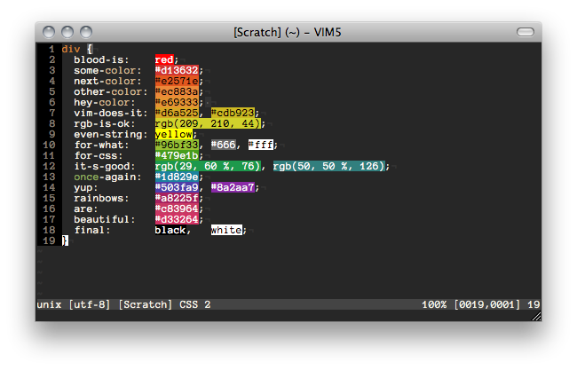
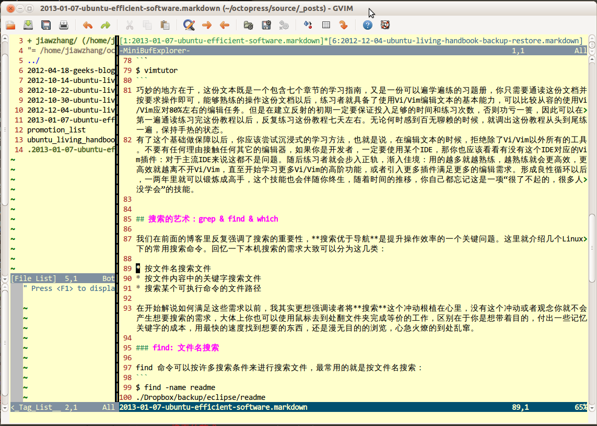
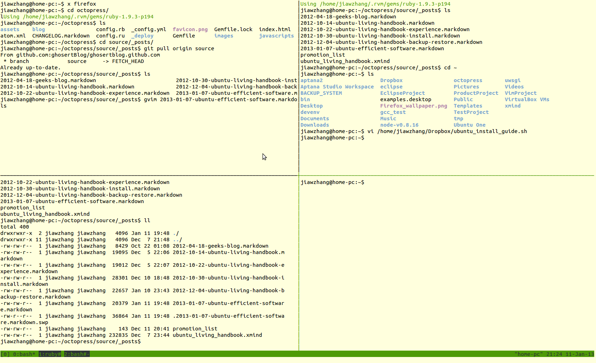
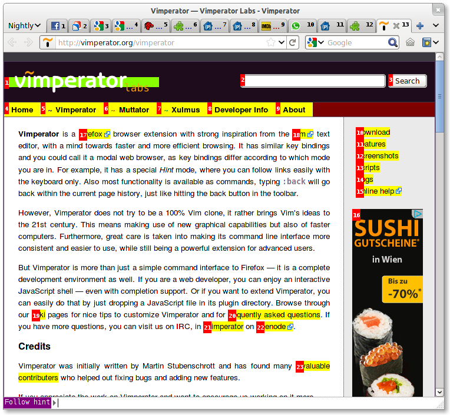

## Ubuntu常用效率软件简介

之前的一系列博客里，基本上我们夯实了使用Ubuntu系统所需的基础知识，这一篇里我们来谈谈在这个低调而强大的平台上，如何使得操作者遵循系统的设计理念，通过恰当的选用软件，从而达到人机合一的化境，将这个平台的潜能发挥到极致，进而十倍，百倍的提升操作者的生产效率。我们就接着聊聊Ubuntu/Linux下的常用效率软件，网络上常常有Linux用户在学习，使用了这个平台上的软件以后发出这样的感叹：“几乎每一个Linux软件都可以写成一本书”。这基本上就是Linux系软件强大到令人敬畏的最好注脚。也因此在有限的篇幅里不可能涵盖那么多软件的方方面面，更何况笔者本人视野有限，故以下文字只做提纲挈领的引介，希望起到抛砖引玉，启示读者的作用。这一篇里先对常用软件做简介，考虑到Linux作为一个开发者系统的角色，我们在下篇里再介绍针对开发者需要的软件。大体上我会按以下思路介绍每个软件：

1. 软件背景
2. 安装配置
3. 入门与心得

## 编辑器之神：GVim

Vi/Vim是Linux系机器默认标配的编辑器软件，基本上我认为你可以不需要Linux上的任何其它软件，但是你不可以说：“我想学Linux，但是我不想学Vi/Vim”。Vi/Vim的学习曲线很高，但是你一定需要学会的理由是：

**1. 文本系统**

Linux系统是基于命令，文本配置的系统，更别说如果你还是一个开发者需要写代码，不能熟练使用世人尊称编辑器之神的杀手级应用，你在这个GUI不友好的世界里其实寸步难行。

**2. 无处不在**

如果你使用Linux，意味着你不会安心的只使用自己的本地桌面，装上Vi/Vim替代品假装不需要学习Vi/Vim，你更有可能需要远程登录到一个陌生环境去操作另一台Linux，而那个机器上80%的可能只有默认标配的Vi/Vim，这种状况下任谁都会感到很局促，也有变通的方法：我看到很多Windows下的开发者使用ftp客户端从远程机器上去拖拽几个G的日志文件到本地，然后再使用Windows上的编辑器花几分钟时间加载这个巨大的文件，这还没有结束，如果问题没有解决，这个痛苦费力的过程会继续一而再，再而三的重复下去。这个时候我常常想他们为什么不把这些时间花在学习Vi/Vim上呢？

**3. 高效编辑**

作为编辑器，Vi/Vim发展至今，再配合精良的插件机制，其功能的丰富和强悍已经超越了人类可以做到想到的极限。在最初，鼠标出现以前，人类只能依靠键盘操作电脑，码字，尤其是如何高效码字是其中重要的一项操作，Vi/Vim就是被设计成高效使用键盘码字的工具。所以它分了三种编辑模式，在细节上，规定所有击键行为只发生在主键盘区：只是为了避免双手哪怕多几个厘米间的位移产生的效率损耗。还是为了向效率妥协，它设计了种种反人类的操作方式来实现各种编辑功能，为了追求编辑效率，它向人类施加操作成本和记忆负担。在鼠标出现以后，理应只为键盘服务的码字软件却因为它的高效设计在程序员中间依然有很高的接受度。这种现象其实更应该让我们反思今天所谓讨好普通用户的人机设计中到底存在哪些问题。

**4. 一劳永逸**

学习Vi/Vim并不是在学习Vi/Vim本身，而是在学习一套使用键盘操控计算机的规范(例如：hjkl表示左下上右)，由于这套规范被很多人认可接受已经成为一种**标准规范**，所以这套**标准规范**被嫁接到其它许多的软件上诸如：Vimperator， w3m， Eclipse， 甚至是GVim的死敌Emacs。可见作为一种约定成俗的标准，学习Vi/Vim的边际效益十分可观，你只要学会这种规范，就可以在许多地方——不止于编辑器本身，发挥学习成果的威力，我们在下面的文字中会看到许多这样的案例，先讲一个小例子，在终端中输入：

```
$ set -o vi
```

可以开启以兼容vi的快捷键操作bash命令，此时你可以在终端使用Esc切换到命令模式，在命令模式下，按 h，l 可以左右移动光标，按 j，k 可以切换前一条后一条命令。x可以修改字符，"$， ^"可以返回命令尾部或头部，i 可以返回编辑模式。

### 软件安装配置

Vi/Vim 本身不需要安装，但是如果你更乐衷于视觉效果更好，功能更丰富的GUI版本可以安装GVim:

```
$ sudo apt-get install vim-gnome
```

安装完毕以后，在终端界面中随时键入以下命令就可以开始编辑文件：

```
$ vi filename$ gvim -f filename # Ubuntu 12.04 和 gvim 有冲突，需要加 -f 参数，否则启动gvim后有假死现象。
```

配置文件位于：

1. ~/.vimrc 主要用于编辑器本身相关的设置，例如：字体，快捷键，插件相关设置。
2. ~/.vim 目录用于存放设置前后背景色，语法高亮等主题文件，第三方插件文件等。

插件管理：

由于传统的Vim插件只需要在下载后拷贝进上述 ~/.vim 目录，一来不方便管理：每个插件都会有三四个子目录散落在~/.vim这个主目录里，二来不方便更新插件：如果插件有更新，需要重复拷贝插件至~/.vim目录的步骤。为了解决这两个问题，最近比较流行的插件管理方法是首先安装另一个名为 [pathogen](https://github.com/tpope/vim-pathogen) 的管理插件的插件，然后新建目录

```
$ mkdir -p ~/.vim/bundle
```

以后所有的插件都可以通过 git clone 的方式（关于 git，有兴趣的同学可以先参考这里： [github](https://github.com/)），拷贝到 ~/.vim/bundle 例如：安装名为 [vim-css-color](https://github.com/skammer/vim-css-color) 的插件用于高亮css中的颜色代码，只需要：

```
$ cd ~/.vim/bundle$ git clone https://github.com/skammer/vim-css-color.git
```

这样插件文件会被集中管理在~/.vim/bundle/vim-css-color，同时只需要在插件目录中执行 git pull 就可以一键更新，vim-css-color 插件效果图如下。



### 入门与心得

Vi/Vim 纵使有诸多好处，阻碍人类使用它的最大障碍在于陡峭的学习曲线。我在网络上听到过哀鸿遍野的声音：“学不会快捷键，学了就忘，太难用了，放弃了”。因为没有循序渐进的阶梯，所以希望学会Vi/Vim的初学者需要集中一段时间的精力反复操练，好像一道坎一样，跨过去别有洞天，过不去就放弃了。再打个鲤鱼跃龙门的比方，你需要卯足了气力使劲跳，跳过去成龙，跳不过去放弃了就始终是条鱼，这就是学习Vi/Vim的真实写照。所以这个事情首先取决于练习者的决心，其次我们再来讲一些学习技巧。

关于学习Vi/Vim的资源，在网络上不计其数，我看到过各种书籍，文章，博客，有同学很认真的在阅读，翻看，甚至记录笔记，还有许多同学，把所有快捷键的图片作为背景设置在桌面上，甚至彩打在纸张上，贴在自己的电脑边。这里面其实有一些问题：

1. 只言片语的文章博客并不能系统的告诉你到底哪些Vim操作是最基本需要掌握的。
2. 反过来，煞有其事的找来一本书看，你又迷失在“知识”的海洋里。
3. 因为知道学习Vi/Vim这个事情是有记忆成本的，而采用设背景，贴墙纸的方法试图能时常提醒自己不要遗忘各种键法。

看上去逻辑很完备，但是对于一个强调操作和手感的工具，大多数同学的努力实际上找错了方向：**找手感需要锻炼的是肌肉记忆而不是脑力记忆**。关键的问题不在于你看了多少关于 Vi/Vim 的文章，书，记了多少笔记，脑子是否记住了那些快捷键，关键的问题在于**你对最基础的操作有过多少次反复的练习，通过这些大量的练习是否建立起了适用情景和键法之间的条件反射，我这里称其为肌肉记忆**。你需要的是通过大量的基础练习强化神经脊髓质的厚度，训练自己建立情景<->键法的条件反射，把这种反射刻在肌肉记忆里，一旦通过训练形成这种反射，在某种程度上，就是比思考或者回忆更有效的应激反应，也就是说你可以省去思考或者回忆的过程，直接对某个场景做出编辑操作，例如：拷贝一段文字到另一端文字后面，删除替换某个词语，回到文件头部等等，你不用去想我该按哪些快捷键去做这些操作，你的双手很自然的就会敲击出正确的键法，省略了耗时的思考，回忆键法的过程，操作者的效率自然倍增。

Vi/Vim 的使用者往往会有这样神奇的体验：小白在你边上看你编辑文本，屏幕上的光标仿佛可以跟随人的眼睛和意念四处游走，操作者没有使用鼠标，完全用键法掌控编辑过程，这个时候小白经不住打断你，询问你怎么复制指定的段落，你往往不能马上回答，你需要重新把双手放回主键盘区，让你的手自然击键给出正确的答案，这就是我们之前说的条件反射替代了思考回忆，记住这个操作的是通过反复训练的肌肉而不是你的大脑，所以手可以迅速地给出答案，但是大脑没办法马上回答，它需要回忆动作，分解操作步骤，最后确认无误，再告诉你答案。通过刻苦的训练建立条件反射从而提高效率，提升技能水平，这其实和世界上其它的技能修行例如：乐器演奏，书法，外语没有任何区别。引申开去，如果你可以在日常生活中更多的运用这个技巧：建立更多的条件反射替代脑力决策，你就可以更高效，更轻松的完成任务。但是这其中又要有适应场景的辨别能力，经典条件反射其实连狗都可以做到，但是听到铃声没见到肉就开始流口水就上当受骗了。

坏消息是你仍旧需要刻苦的训练，好消息是比起乐器，外语等其它技能，练习Vi/Vim建立条件反射的时间并不很长大约在七天左右，花费七天的时间，换取受益一辈子高效编辑的能力，这实在是一笔合算的交易。况且这里面也没有智力差异的成分，如果觉得自己做不到，想想经典条件反射的实验对象其实是条狗，这个比喻虽然让人不好受，但是真的会很激励人，我自己当时在2006年的一个七天长假里练习Vi/Vim的时候基本就没把自己当人对待。练习的学习资料也唾手可得，很多同学满世界找书，找教程，素不知最有用的教程GVim已经自带了，安装完GVim以后，直接键入：

```
$ vimtutor
```

巧妙的地方在于，这份文本既是一个包含七个章节的学习指南，又是一份可以遍学遍练的习题册，你只需要通读这份文档并按要求操作即可，能够熟练的操作这份文档以后，练习者就具备了使用Vi/Vim编辑文本的基本能力，可以比较从容的使用Vi/Vim应对80%左右的编辑任务。但是在建立反射的初期一定要保证投入足够的时间和练习次数，否则功亏一篑，因此可以在第一遍通读练习完这份教程以后，反复练习这份教程七天左右。无论何时感到百无聊赖的时候，就调出这份教程从头到尾练一遍，保持手热的状态。
有了这个基础做保障以后，你应该尝试沉浸式的学习方法，也就是说，在编辑文本的时候，拒绝除了Vi/Vim以外所有的工具。不要有任何理由接触任何其它的编辑器，如果你是开发者，一定要使用某个IDE，那你也应该看看有没有这个IDE对应的Vim插件：对于主流IDE来说这都不是问题。随后练习者就会步入正轨，渐入佳境：用的越多就越熟练，越熟练就会更高效，更高效就越离不开Vi/Vim，直至开始学习更多Vi/Vim的高阶功能，或者引入更多插件满足更多的编辑需求。形成良性循环以后，一两年里就可以锻炼成高手，这个技能也会伴随你终生，随着时间的推移，你自己都忘记这是一项“很了不起的，很多人没学会”的技能。

以下是装上若干插件以后的效果图：



## 搜索的艺术：find & grep

我们在前面的博客里反复强调了搜索的重要性，**搜索优于导航**是提升操作效率的一个关键问题。这里就介绍几个Linux下的常用搜索命令。回忆一下本机搜索的需求大致可以分为两大类：

- 按文件名搜索文件
- 按文件内容中的关键字搜索文件

在开始解说如何满足这些需求以前，我其实更想强调读者将**搜索**这个冲动根植在心里，没有这个冲动或者观念你就不会产生想要搜索的需求，大体上你也可以使用鼠标去到处翻文件夹完成等价的工作，区别在于你是想带着目的，付出一些记忆关键字的成本，用最快的速度找到想要的东西，还是漫无目的的浏览，心急火燎的到处乱窜。这里再提一个搜索的小技巧，可以让你直观的感受搜索的强大：在终端界面里有时不可避免的需要重复输入一串很长的命令，这个可能是使用终端的用户相对于GUI最大的抱怨，“反复输入这么长的命令很烦人”，“我怎么可能记得住那么长的命令”，这个时候，你可以只记住这串命令中的某几个关键字，然后在终端界面上按Ctrl-r进入搜索模式，键入你刚才记住关键字譬如gvim:

```
(reverse-i-search)`gvim': gvim 2013-01-07-ubuntu-efficient-software.markdown
```

这样系统会自动提示你之前输入过的和gvim相关的命令，如果不是你想要的，继续按Ctrl-r提示下一条命令，直至找到你想要的命令，按回车即运行，如果最终都没有找到按Ctrl-c退出搜索模式即可。这个技巧虽然很小但是非常实用，解决了我自己刚入门时一个很大的困惑：）。

### find: 文件名搜索

find 命令可以按许多搜索条件来进行搜索文件，最常用的就是按文件名搜索：

```
$ find -name readme./Dropbox/backup/eclipse/readme./Dropbox/backup/windows/EnsoLauncher/readme./TestProject/web-workspace/TestStruts/readme
```

上述命令指在当前目录下查找文件名是readme的文件，如果文件名过长你无法完全记住，可以选加通配符减小记忆负担例如：

```
$ find -name read*./Dropbox/backup/eclipse/readme./Dropbox/backup/windows/EnsoLauncher/readme./TestProject/web-workspace/TestStruts/readme
```

更多用法参考 man：

```
$ man find
```

### grep: 文件内容搜索

grep 是很多有经验的开发者最常用的一个命令，如果你不知道文件在哪里，但是你知道文件中的几个关键字，你就可以把它找出来：

```
$ grep 搜索的艺术 * -rsource/_posts/2013-01-07-ubuntu-efficient-software.markdown:## 搜索的艺术：find & grep
```

这个是我在本机搜索这篇博客当前小标题的结果， * 是指搜索当前目录的所有文件， -r 是指递归当前目录进行搜索。更多用法参考 man：

```
$ man grep
```

## 砍掉使用鼠标最后的借口：keynav

使用一个Linux系统虽然在80%的状况下你可以没有障碍地使用键盘完成所有操控，但是仍然可能会有一些只能使用鼠标的状况出现，例如：某个GUI软件没有提供相应的快捷键，或者即使提供了，你还不清楚。这个时候可以调出 [keynav](http://www.semicomplete.com/projects/keynav/) 这个软件，砍掉使用鼠标的最后一个借口。[keynav](http://www.semicomplete.com/projects/keynav/) 被用来替代鼠标点击屏幕上的任意一个像素。它的设计思想是这样的：运用键盘快捷键，它可以显式的将整个屏幕分割成四个区域，然后输入hjkl代表左下上右（很耳熟？）像两分法那样，把整个屏幕分割成左一半或者下一半或者上一半或者右一半，在当前的半个屏幕内重复输入hjkl持续进行屏幕的两分操作，这样显式高亮的区域会越来越小（多一次分割面积缩小一半），一直小这个区域的中心点和你想点击的目标区域重合，这个过程就是模拟鼠标从当前位置移动到目标位置的过程，此时再次键入快捷键完成模拟鼠标点击的动作即可，这样理论上，在没有更好选择的情况下，你就可以使用键盘模拟鼠标完成任意点击工作，进而避免双手在主键盘区和鼠标之间的来回切换，节省宝贵的操作时间。那么这样做效率如何？根据计算，在一块分辨率为 1920x1200 的屏幕上（适用屏幕尺寸在24英寸以上），点击屏幕上任意一个像素的最坏情况是击键21次做两分法分割屏幕的动作，这个结果有点糟糕，但是实际上，不是每个人都有那么大的屏幕（适合文本工作的显示器大小是22英寸，可以得到最佳字点距，此时分辨率大小为 1680x1050），再者，就算是鼠标，也没有认定需要精确到一个像素的大小才可以点击，我们点击的对象往往是一个像素区域，例如：一个工具栏，一个按钮，一个文本框，这样以点击按钮为例：按钮占据60x25个像素区域，在1920x1200的屏幕上最差需要击键11次完成定位。这个只是最差情况，以笔者22英寸显示器的使用经验来说，4到5次击键即可完成定位，效率不会比鼠标更高，但是完成定位点击的耗时绝对不会比省下切换鼠标的时间更多。至此，我们完成了使用 [keynav](http://www.semicomplete.com/projects/keynav/) 替代鼠标的理论验证和实践证明，读者不妨可以大胆拔掉鼠标。

### 安装配置与入门

Ubuntu 的官方源默认自带这个软件：

```
$ sudo apt-get install keynav
```

配置文件位于：~/.keynavrc 可自行修改快捷键。

另外你可以设法让这个软件随机启动：

```
$ vi ~/.xprofile
```

加入一行：

```
keynav
```

重新登录系统即可。

首次启动后，按 "ctrl + ;" 激活显式高亮区，再按hjkl移动定位，最后按空格键模拟鼠标点击。掌握这个软件并不需要太长时间，可以参考 [官网](http://www.semicomplete.com/projects/keynav/) 和 [demo](http://www.semicomplete.com/projects/keynav/keynav.html) 演示。

更多用法参考 man：

```
$ man keynav
```

## 文本浏览器：w3m

在这个GUI横行的世界，笔者推荐一个兼容中文的文本浏览器：w3m，你需要一个文本浏览器的理由：

**1. 速度和专注**

无需加载图片，加载速度更快，使用户专注文字内容本身，适合比较纯粹的文字阅读，特别是文档查阅。

**2. 运行在终端界面**

它很酷，只需要 bash shell 终端就可以运行，也就是说你是在命令行里上网，即使没有GUI图形系统，也不能阻碍你访问 Web，在许多场合这很重要：

- 无法进入图形界面需要上网搜索方案
- ssh远程登录到某个主机的时候需要直接在那台主机上下载文件，或许那台主机的网速比较给力也没有墙，你也可以避免先在本地下载，再把文件传送到远程机，所以你需要在远程机的终端里直接访问 Web。

**3. 全键盘操作**

终端界面的另一大好处是无法使用鼠标，这就迫使你使用键盘操控文本浏览器，提升浏览效率。而且如果你会使用 Vi/Vim，那么操控 w3m 的体验和 Vi/Vim 高度相似(使用hjkl移动光标，/keyword 查询关键字等等)。

**4. 格式渲染，中文支持完善**

使用 w3m 的 web 渲染效果很美观，用 w3m 访问 gmail 的效果图：


### 安装配置与入门

安装 w3m 非常简单：

```
sudo apt-get install w3m
```

如果想更改部分快捷键，例如：更改上下翻页的快捷键和 Vi/Vim 的翻页快捷键一致（Ctrl-d，Ctrl-u），可以新建文件：

```
vi ~/.w3m/keymap
```

输入以下内容，重新绑定快捷键：

```
keymap C-d NEXT_PAGEkeymap C-u PREV_PAGE
```

安装完毕以后，打开终端输入：

```
$ w3m http://www.douban.com
```

即可访问豆瓣，hjkl：移动光标，/keyward回车：搜索关键字并定位光标到目标对象，如果目标是一个链接，直接回车即可跳转。持续的按Tab键则可以自上而下的切换当前页面上的链接，回车可以跳转，按Tab+Shift则自下而上反向切换。最最基本的功能就是这些，如果想查看更详细的功能，打开 w3m 后按 Shift+h 查看快捷键。

## 屏幕管理器：tmux

作为一个以命令行终端为基础的操作系统，有效率的Linux用户会花费大约30%以上的时间在自己的终端界面上，一个功能强大，用户友善的终端界面管理软件会显得很贴心。这里笔者介绍一下 tmux 这个软件。tmux 是一款用于管理终端界面的程序，主要功能有以下几个：

**1. 可分割，多Tab的终端窗口**

在一个整块的屏幕终端界面上切分出任意多个子窗口，例如：你可以在屏幕的左半个区域里编辑文字，右半个区域里查看资料，提高屏幕空间的利用率，用户可以在一屏的空间里同时看到两个终端的内容，节省切换终端的麻烦，这个功能在大屏幕时代相当实用。好像现代浏览器的Tab概念类似，tmux里也可以方便的新建，切换，关闭不同的Tab代表不同的终端。有了可分割和多Tab的终端，这样你就无需为了不同的目的开启多个终端界面，尤其在登录到远程主机的时候很有用：避免反复开启本地终端远程连接主机或者不停将前台程序切换到后台运行为了腾出当前终端的控制权，你只需要一个远程连接就可以随意开启任意多个终端，并且在这些终端里快速切换。

**2. 复制终端文本**

传统的终端界面，只能使用鼠标复制界面上的文本，tmux 的一个附加福利是允许你用键盘进入编辑模式，复制粘贴终端上的任何文本。例如你正在终端里编辑一个文档，里面需要一个很长的路径，你可以划分出一个新终端，运行获取路径的命令，然后把结果复制到原先终端的编辑器里。期间的光标移动和搜索命令仍然是Vi/Vim类似的hjkl/等。

**3. 保留终端屏幕会话**

使用ssh远程登录到一个主机上使用终端的同学如果正在跑一个非常耗时的命令，这个时候除非你把它切换到后台运行，否则当你登出主机的时候这个任务也会被自动停止，非常不方便，你可使用tmux的dettach功能将屏幕会话保存起来，然后登出主机，下次重新登录到主机的时候使用tmux attach命令把上次保存的会话恢复回来。又假设你在办公室里终端上的工作仍然没有结束，但是下半时间到了，需要去赶班车，这个时候你还是可以dettach当前的屏幕状态，等到家以后ssh远程连接到公司电脑，tmux attach恢复离开公司时候的终端状态，继续当时的工作，就好像你又回到了办公室的机器前一样。

### 安装配置与入门

运行安装：

```
$ sudo apt-get install tmux
```

配置文件位于：~/.tmux.conf，可以编辑此文件，将其中的 **set -g prefix C-b** 改作 **set -g prefix C-a** C-a代表了Ctrl+a，是一个前缀键，所有的tmux快捷键都需要先按这个前缀键才能工作，因为Ctrl+a比起默认的Ctrl+b更方便按键，所以有了这个微调。

启动tmux，在终端里执行：

```
$ tmux
```

即可进入tmux界面，按下 C-a v 做垂直方向的分屏，C-a s 做水平方向的分屏，这个分屏动作可以一直持续。C-a h,j,k,l 移动光标至左下上右四个方向上的相邻分屏，键入 exit 退出某个分屏，最后 C-a d 可以dettach整个tmux会话，如果需要恢复这个会话，只需要在终端键入：tmux attach

以下是一个分割出四个区域三个Tab的 tmux 效果图，注意图片左下角绿色状态栏的三个单词代表了三个Tab，带*号的Tab表示当前Tab，黑色高亮的那两个单词表示另外两个非当前Tab的终端内容有变化，例如你在当前Tab内编辑文本，在另外的Tab里如果有log输出，那么就会有黑色背景提醒你需要查看变化。图片右下角的状态栏上同样很贴心的给出了当前系统时间和计算机的hostname：



## 火狐的瑞士军刀：Vimperator

除了终端以外，另一个使用率超高的软件非浏览器莫属，在我们这个时代，很多人开机恐怕就是为了打开浏览器，如果你会有50%的时间生活在浏览器里，那就应该想想怎么在浏览器里提高自己的生活质量了：好在我们有Vimerator。Vimperator是一个由 Vim 获取灵感的 FireFox 插件，完全颠覆了使用浏览器的传统观念。它的设计目标就是像Vim那样使用键盘操控浏览器，并且兼容Vim操控的**标准规范**：你可以使用Vim的快捷方式。只是想象一下使用键盘无须鼠标你就可以操控浏览器，这有多炫目！个人认为无论怎么赞美这个插件的伟大都不会过分，它存在的意义已经超过了火狐浏览器本身，许多用户可能会对火狐浏览器本身颇有微词，但是这个插件的出现使得火狐本身的缺陷不再那么重要，无论是chrome或者IE，在没有同等分量的插件出现以前，很难说服习惯Vimperator的用户迁移到其它浏览器。

希望chrome的粉丝可以压住自己的火气，我们再讲一些道理。

我在前面的博文里提到过这样一个观点：我们不是在一个茹毛饮血的蒙昧年代，几十年前电脑低下的计算能力甚至都无法满足纸带输入的速度，人有充裕的输入带宽，而计算机的接收带宽则相当狭窄，无法提高效率的责任和瓶颈在机器那边，人往往需要等待机器。今时今日则大不一样，人和机器的地位逆转，一代一代的芯片技术革新，使得机器有足够的处理带宽完成人类给定的任务，并不是机器太慢无法处理足够多的任务，而是我们人类的思维速度，反应速度和操作速度无法喂饱机器强大的处理能力。如果觉得效率有问题，那么责任在我们这边，我们才是瓶颈。你应该让自己更聪明，更快的思考，更准确的思考，更有效率的操作。提升自己的一个方法就是付出脑力成本，刻苦的训练，建立适应场景的条件反射。也许火狐的渲染加载速度确实不如chrome，但是如果它的任何操作都无需导航或者鼠标导向，那么一个训练有素的用户，仍然可以从每一次点击，关闭，新建，搜索，复制，跳转这些最基础的操作速度上受益，积累效率优势，最后不但弥补了火狐本身的性能问题，还可以用十倍以上的工作效率完胜chrome。

想清楚这个道理，这个是我们进行选择的前提。下面谈谈 Vimperator 的几个特色功能：

**1. Vim 兼容**

所以讨论火狐快还是chrome快没有意义，软件对于渲染速度的差别微乎其微。关键在于哪个平台可以提供让人更快的工具。Vimperator就是火狐给出的答案--火狐再不好，好在它有强大的插件系统，插件生态圈和开发者的历史积累。Vimperator最聪明的做法还是遵守兼容了Vim对于键盘操作计算机的规范。降低了用户的学习成本。你还是可以例如：使用 h，j，k，l来翻页，/ 来搜索。

**2. 快速访问常用网站**

在当前网站的页面上你只需要下shift+m，然后再按下某个字母数字键，比如：你在新浪首页，按下shift+m后，再输入s，这样s就指带了新浪的网站，下次你需要访问新浪的时候，无需输入网址，只需要按三个键：gns 浏览器随即打开新的Tab加载新浪页面。

**3. 革新的浏览器人机交互**

Web 最重要的特征就是可以跳转的链接。Vimperator 充分考虑了浏览器的人机交互特征，如果你没有使用过类似的工具，你也许可以想象使用快捷键在浏览器里翻页，滚屏，前进，后退，但是你可能无法想象如何使用键盘点击网页上的链接。看看 Vimperator 的做法，这是一个很讨巧，很聪明的做法：



装完这个插件以后，按下 f 键，页面上所有可以点击的对象包括：链接，图片，文本，按钮都被显式高亮，并且标上数字记号。这个时候你只需要在键盘上按下相应的数字就代表了一次鼠标点击。你也可以使用搜索关键字的方法，定位到一个链接，然后直接回车跳转。这远比一次鼠标导航要高效。

**4. 整合的垂直搜索**

再来看看Vimperator的搜索功能：强大到恐怖的搜索。传统搜索引擎的需求实际上正在被更垂直的搜索请求取代：如果我想买个手机，我可能会去淘宝的搜索栏进行搜索。如果我想了解某个专业问题的答案，我可能想去社区问答网站比如：知乎，quora 寻找专业意见。书评或者影评可能在豆瓣上会更靠谱。搜索一个英文单词的含义用法可能在dictionary.com 云词这类在线词典上更好，它无需本地词库还可以反复复习。科普知识我会用维基百科查询。我们需要一个工具统一解决这么多的垂直搜索需求请求！Vimperator这样给出答案：无论你在哪个当前页面，按下 t 键进入命令模式：

:tabopen t galaxy note回车

浏览器随即跳转至淘宝的的galaxy note搜索结果页面，你无需敲击淘宝网址，无需在搜索框里输入，你只要记住命令中的 t 代表了淘宝。而且这种搜索引擎可以无限扩展内置，你可以将任意需要垂直搜索的网站加入，附上t这样的关键字即可。（注：淘宝系我手工加入的搜索引擎，默认情况下你未必可以实现淘宝搜索）如果你仍然需要最常用 Google 搜索，则更简单一些：按下 t 键进入命令行模式：

:tabopen galaxy note回车

以上只是 Vimperator 众多令人炫目的功能中的几个，读者可以依据帮助文档自行学习挖掘。使用火狐浏览器点击[vimperator-addon](https://addons.mozilla.org/en-US/firefox/addon/vimperator/?src=search)安装插件，重启浏览器后输入：

:help回车
